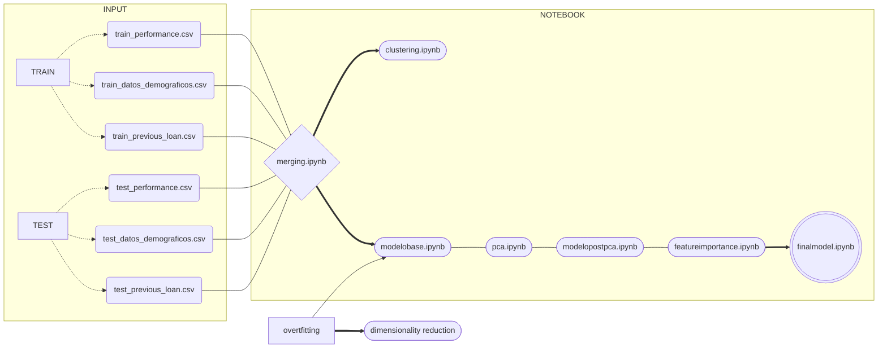

# Introducción
### Requisito

Para ver todo el contenido del repositorio es necesario contar con Docker Desktop y con Git instalado en la terminal desde el que se quiere realizar la prueba de esta demo. También será necesario clonar este repositorio y posteriormente, dentro de la carpeta clonada, creamos el contenedor de Docker.
A continuación, los comandos a ejecutar desde el CMD:

1. Clonar repositorio:

<pre><code>git clone https://github.com/Data-Project-3/DataProject3.git</pre></code>

2. Creamos el contenedor que contiene Jupyter:

<pre><code>docker-compose up -d --build </pre></code>

Esperamos un poco y comprobamos la siguiente url en nuestro navegador: http://localhost:8888/ , pues ahí está nuestro Jupyter.

Nos pedirá una contraseña o token y tendremos que introducir: grupo4

Posteriormente le damos a *Log In* y se mostrará una única carpeta llamada 'work', clicamos en esta.

Una vez realizados los anteriores pasos, nuestra pantalla debería mostrar lo siguiente:


# bbank


# ¿Quiénes somos?

1. Banco que nace hace apenas unos años y que cuyo valor principal es la sostenibilidad.
2. Desde bbank nos importa que con el dinero se consiga tener un impacto en el mundo, en busca del cambio social, ambiental y cultural para un futuro mejor.
3. Como banco, una de nuestras grandes prioridades es conocer el riesgo crediticio, saber que capacidad y probabilidad tienen nuestros clientes de devolvernos la cantidad prestada (con sus respectivos intereses). 

# Nuestra predicción del Riesgo Crediticio

Al pedir un préstamo a una entidad financiera nos enfrentamos a dos problemas:
1. <strong>Disposición a pagar.</strong>
2. <strong>Capacidad económica de afrontar el pago.</strong>
#
En general hay 2 tipos de modelos de riesgo.
1. <strong>Riesgo de nuevo negocio. </strong>Se utiliza para evaluar el riesgo de las solicitudes asociadas con el primer préstamo que solicita.
2. <strong>Modelo de riesgo de repetición o comportamiento.</strong> El cliente ya contrató un préstamo y solicita uno nuevo. En este caso, tendremos información adicional sobre cómo pagó sus otros préstamos.
#
Objetivos:
1. <strong>Clustering </strong> para ver qué tipos de cliente tiene el banco.
2. <strong>Clasificador</strong> que indique si el préstamo es bueno o no.
#
<p align =center><strong>Contamos con los siguientes datasets</p></strong>

1. <strong>Datos demográficos (*train_datos_demograficos.csv*).</strong>Información sobre el cliente como edad, empleo, estudios, etc.,
2. <strong>Performance Data (*train_performance.csv*).</strong> Este conjunto de datos incluye los préstamos de los clientes que hay que predecir. Básicamente, necesitamos predecir si este préstamo pasaría el modelo dado el histórico de préstamos anteriores y los datos demográficos de un cliente.
3. <strong>Datos de préstamos anteriores (*train_previous_loan.csv*).</strong> Este dataset incluye todos los préstamos anteriores que el cliente tenía antes del préstamo anterior para el cual queremos predecir el rendimiento. Cada préstamo tendrá un systemloanid diferente, pero el mismo customerid para cada cliente.
```mermaid
classDiagram
  direction RL
  class datos_demograficos {
    -id: customerid
    -birthdate (Fecha de nacimiento del cliente)
    -bank_account_type (Tipo de cuenta Bancaria)
    -longitude_gps (Coordenadas de Longitud)
    -latitude_gps (Coordenadas de latitud)
    -bank_name_clients (Nombre del banco)
    -bank_branch_clients (Localización del Banco)
    -employment_status_clients (Tipo de empleo del cliente)
    -level_of_education_clients (grado de formación del cliente)
  }
  direction RL
  class performance {
    -id: customerid
    -Systemloanid (ID asociado para un préstamo en particular)
    -bank_account_type (Tipo de cuenta Bancaria)
    -longitude_gps (Coordenadas de Longitud)
    -latitude_gps (Coordenadas de latitud)
    -bank_name_clients (Nombre del banco)
    -bank_branch_clients (Localización del Banco)
    -employment_status_clients (Tipo de empleo del cliente)
    -level_of_education_clients (grado de formación del cliente)
  }
    direction RL
  class previous_loan {
    -id: customerid
    -Systemloanid (ID asociado para un préstamo en particular)
    -Loannumber (El número del préstamo que hay que predecir)
    -Approveddate (Fecha en la que se aprobó el préstamo)
    -Creationdate (Fecha en que se creó la solicitud del préstamo)
    -Loanamount (Cantidad pedida en el préstamo)
    -Totaldue (cantidad total requerida para liquidar el préstamo)
    -ClosedDate (Fecha en la cual se liquidó el préstamo)
    -Referredby (Customerid del cliente que remitió a esta persona)
    -Firstduedate (Fecha del primer pago)
  }
  ```
  
  #
<p align =center><strong>Así queda el dataset final tras transformarlo:</p></strong>
  
  ```mermaid
  classDiagram
    direction RL
  class bestdata {
    -id: customerid
    -loannumber
    -loanamount
    -totaldue
    -termdays
    -good_bad_flag
    -realage
    -TipoInteresAhora
    -bank_account_Other
    -bank_account_Savings
    -level_of_education_clients_Unknown
    -bank_name_client_GTBank
    -employment_status_client_Permanent
    -employment_status_client_Unknown
    -is_late_for_firstpay
    -exceeds_loan_term_days
    -good_bad_flag
    -TipoInteres
    }
```

# Arquitectura de la solución





# Acciones realizadas


Antes de realizar cualquier decisión, preprocesamos nuestros datos que se encuentran en 1. Input raw data con los tres datasets mencionados. Para no tomar decisiones  a ciegas sobre transformaciones, se hace un exploratorio analítico de los datos que se encuentra en 4. EDA . 

En primer lugar, sacamos información del previous_loan.csv y juntamos los datasets mediante el customerid en el PreProcess.py . A este intento lo llamamos 'Primera Prueba'. Al tener ya nuestro dataset preparado, lo entrenamos y sacamosel modelo base dentro de la carpeta Modeling. Al tener overfitting, decidimos reducir dimensionalidad mediante PCA, sacar los modelos óptimos (CredirRskDespuesPCA) y al ver había cabida para mejorar, realizamos feature importance para poder hacer una vez más nuestros modelos. Todos ellos utilizando la técnica grid search para la optimización de hiperparámetros. Además de, realizar un clustering, un modelo especifico para xgboost y otro feature importance.

Al no conseguir buenos resultados, decidimos realizar diferentes transformaciones en el preprocesamiento resultando en '6. Segunda Prueba' donde encontramos merging.csv donde está el dataset con el que trabajaríamos. Rápidamente, al hacer tres modelos de xgboost con su grid search y al no encontrar un buen accuracy rápidamente decidimos realizar unas últimas transformaciones.

La Tercera Prueba, se encuentra en la carpeta numero 7 donde nos encontraremos con las decisiones que nos hemos quedado. Dentro de modeling, encontraremos de primeras el notebook Merging aqui encontraremos todas las transformaciones desde el tipo de interes hasta si se pagó la deuda en el plazo o no. Ya satisfechos con estas transformaciones, realizamos los mismos pasos que con la Primera Prueba: un modelo base (encontrarse overfitting), aplicar después un PCA, volver a calcular los modelos, realizar reducción de dimensionalidad con feature importance y finalmente quedándonos con el Final Model donde encontramos nuestro modelo óptimo y finalmente lo entrenamos con los 2 conjuntos: train y test conseguiendo mejor accuracy.


