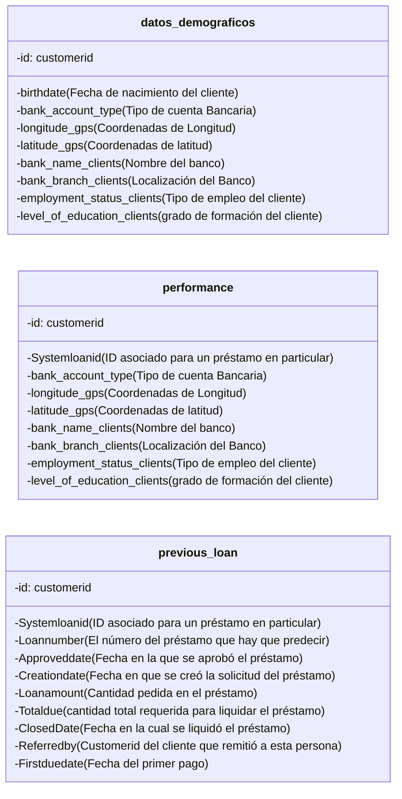
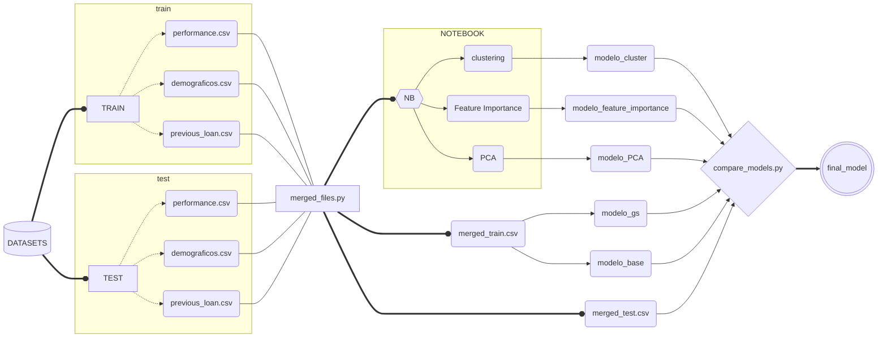
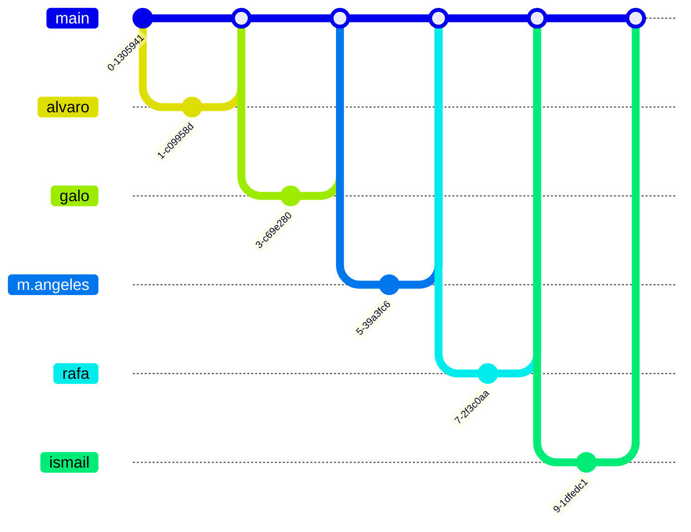

# Introducción
### Requisito

Para ver todo el contenido del repositorio es necesario contar con Docker Desktop y con Git instalado en la terminal desde el que se quiere realizar la prueba de esta demo. También será necesario clonar este repositorio y posteriormente, dentro de la carpeta clonada, creamos el contenedor de Docker.
A continuación, los comandos a ejecutar desde el CMD:

1. Clonar repositorio:

<pre><code>git clone https://github.com/Data-Project-3/DataProject3.git</pre></code>

2. Creamos el contenedor que contiene Jupyter:

<pre><code>docker-compose up -d --build </pre></code>

Esperamos un poco y comprobamos la siguiente url en nuestro navegador: http://localhost:8888/ , pues ahí está nuestro Jupyter.

Nos pedirá una contraseña o token y tendremos que introducir: grupo4

Posteriormente le damos a Log In y se mostrará la siguientey clicamos en la carpeta 'work'.

Una vez realizados los anteriores pasos, nuestra pantalla debería mostrar lo siguiente:

# bbank

# ¿Quiénes somos?

1. Banco que nace hace apenas unos años y que cuyo valor principal es la sostenibilidad.
2. Desde bbank nos importa que con el dinero se consiga tener un impacto en el mundo, en busca del cambio social, ambiental y cultural para un futuro mejor.
3. Como banco, una de nuestras grandes prioridades es conocer el riesgo crediticio, saber que capacidad y probabilidad tienen nuestros clientes de devolvernos la cantidad prestada (con sus respectivos intereses). 

# Nuestra predicción del Riesgo Crediticio

Al pedir un préstamo a una entidad financiera nos enfrentamos a dos problemas:
1. <strong>Disposición a pagar.</strong>
2. <strong>Capacidad económica de afrontar el pago.</strong>
#
En general hay 2 tipos de modelos de riesgo.
1. <strong>Riesgo de nuevo negocio. </strong>Se utiliza para evaluar el riesgo de las solicitudes asociadas con el primer préstamo que solicita.
2. <strong>Modelo de riesgo de repetición o comportamiento.</strong> El cliente ya contrató un préstamo y solicita uno nuevo. En este caso, tendremos información adicional sobre cómo pagó sus otros préstamos.
#
Objetivos:
1. <strong>Clustering </strong> para ver qué tipos de cliente tiene el banco.
2. <strong>Clasificador</strong> que indique si el préstamo es bueno o no.
#

<strong>Contamos con los siguientes datasets
</strong>

1. <strong>Datos demográficos (*train_datos_demograficos.csv*).</strong>Información sobre el cliente como edad, empleo, estudios, etc.,
2. <strong>Performance Data (*train_performance.csv*).</strong> Este conjunto de datos incluye los préstamos de los clientes que hay que predecir. Básicamente, necesitamos predecir si este préstamo pasaría el modelo dado el histórico de préstamos anteriores y los datos demográficos de un cliente.
3. <strong>Datos de préstamos anteriores (*train_previous_loan.csv*).</strong> Este dataset incluye todos los préstamos anteriores que el cliente tenía antes del préstamo anterior para el cual queremos predecir el rendimiento. Cada préstamo tendrá un systemloanid diferente, pero el mismo customerid para cada cliente.

#

<strong>Forma de trabajar, cada uno con su rama (pull request method)
</strong>

