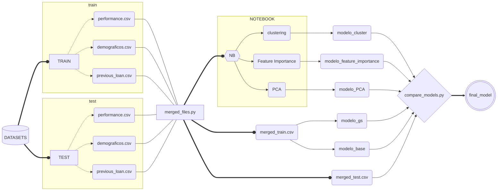

# Predicción del Riesgo Crediticio

Al pedir un préstamo a una entidad financiera nos enfrentamos a dos problemas:
1. <strong>Disposición a pagar.</strong>
2. <strong>Capacidad económica de afrontar el pago.</strong>
#
En general hay 2 tipos de modelos de riesgo.
1. <strong>Riesgo de nuevo negocio. </strong>Se utiliza para evaluar el riesgo de las solicitudes asociadas con el primer préstamo que solicita.
2. <strong>Modelo de riesgo de repetición o comportamiento.</strong> El cliente ya contrató un préstamo y solicita uno nuevo. En este caso, tendremos información adicional sobre cómo pagó sus otros préstamos.
#
Objetivos:
1. <strong>Clustering </strong> para ver qué tipos de cliente tiene el banco.
2. <strong>Clasificador</strong> que indique si el préstamo es bueno o no.
#

<strong>DATASETS
</strong>

1. <strong>Datos demográficos (*train_datos_demograficos.csv*).</strong>Información sobre el cliente como edad, empleo, estudios, etc.,
2. <strong>Performance Data (*train_performance.csv*).</strong> Este conjunto de datos incluye los préstamos de los clientes que hay que predecir. Básicamente, necesitamos predecir si este préstamo pasaría el modelo dado el histórico de préstamos anteriores y los datos demográficos de un cliente.
3. <strong>Datos de préstamos anteriores (*train_previous_loan.csv*).</strong> Este dataset incluye todos los préstamos anteriores que el cliente tenía antes del préstamo anterior para el cual queremos predecir el rendimiento. Cada préstamo tendrá un systemloanid diferente, pero el mismo customerid para cada cliente.

